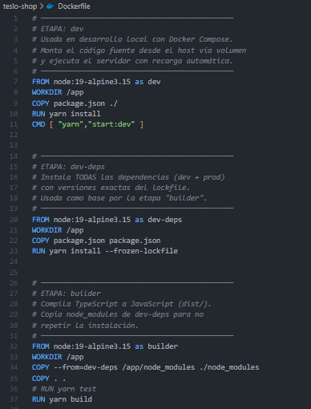
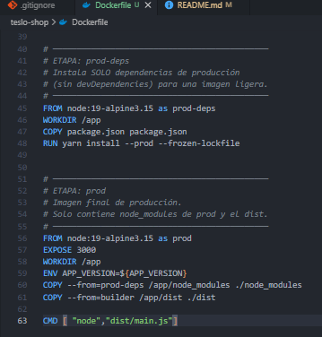
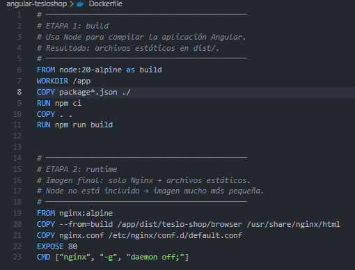
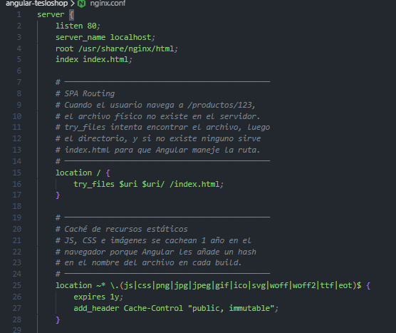
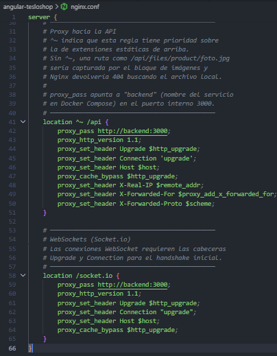

# tesloshop-app

# Práctica Final: Contenerización de TesloShop con Docker y Docker Compose

Este proyecto consiste en empaquetar una aplicación completa (frontend, backend y base de datos) en contenedores Docker, para que se pueda ejecutar en cualquier computadora sin necesidad de instalar Node, PostgreSQL o Nginx directamente. La aplicación se llama **TesloShop** y es una tienda en línea.

---

## Arquitectura del proyecto

La aplicación está compuesta por tres partes principales, cada una dentro de su propio contenedor:

1. **Base de datos (PostgreSQL)**: Almacena los productos, usuarios y demás información de la tienda.
2. **Backend (NestJS)**: Recibe peticiones del frontend, consulta la base de datos y devuelve la información (por ejemplo, la lista de productos).
3. **Frontend (Angular + Nginx)**: Es la interfaz que ve el usuario en su navegador. Además, incluye un pequeño servidor web (Nginx) que sirve los archivos de la página y tambien para enviar las peticiones al backend sin problemas de seguridad.

Los tres contenedores se comunican a través de una **red interna** creada por Docker. Esto significa que pueden hablar entre sí usando nombres cortos (como `db`, `backend`, `frontend`) en lugar de direcciones IP.

## Flujo de comunicación entre los servicios

1. El navegador se conecta al contenedor del **frontend** (puerto 80). Allí se carga la página web.
2. Si el usuario hace clic en "Ver productos", el frontend (Angular) envía una petición a la dirección `/api/products` dentro del mismo sitio web.
3. El servidor Nginx que está dentro del contenedor del frontend **detecta** que la petición empieza por `/api` y la redirige automáticamente al contenedor del **backend**, usando su nombre interno `backend` y el puerto 3000.
4. El backend recibe la petición, consulta la base de datos usando el nombre `db` y el puerto 5432, y prepara la respuesta (por ejemplo, un listado de productos en formato JSON).
5. El backend devuelve la respuesta al Nginx, y este a su vez la envía al navegador. Para el navegador, todo viene del mismo sitio, por lo que no hay conflictos de seguridad (CORS).

Este diseño evita tener que configurar CORS en el backend, porque el frontend y la API parecen estar en el mismo lugar.

## Paso 1: Dockerfile del backend (NestJS)

Un `Dockerfile` es el que le dice a Docker cómo construir una imagen para crear contenedores. El archivo se creo adentro de la carpeta `teslo-shop` y se llama `Dockerfile`.

Se usan varias etapas:

- **dev**: Se usa durante el desarrollo. Permite que el código se actualice en caliente (hot-reload) sin necesidad de reconstruir la imagen cada vez.
- **dev-deps**: Instala todas las dependencias necesarias para compilar y ejecutar la aplicación (incluyendo las de desarrollo).
- **builder**: Toma el código fuente y lo compila (convierte TypeScript a JavaScript). El resultado se guarda en una carpeta `dist`.
- **prod-deps**: Instala **solo** las dependencias necesarias para ejecutar la aplicación en producción (sin herramientas de compilación).
- **prod**: Es la etapa final. Copia el código compilado (`dist`) y las dependencias de producción, y define el comando que arrancará el servidor. Esta imagen es pequeña y no contiene nada superfluo.

## Paso 2: Dockerfile del frontend (Angular + Nginx) y configuración del proxy

### Dockerfile del frontend

Este archivo tiene dos etapas:
- **build**: Usa Node para compilar la aplicación Angular.
- **runtime**: Usa Nginx para servir los archivos estáticos.

### Configuración de Nginx (nginx.conf)

Nginx sirve como servidor web y como proxy inverso:
- Sirve los archivos estáticos de Angular.
- Redirige las peticiones que empiezan con `/api` hacia el backend (`http://backend:3000`).
- Maneja WebSockets para `/socket.io`.

Esta configuración evita problemas de CORS porque el navegador solo habla con Nginx.

## Capturas de Evidencia:

El contenido completo del archivo teslo-shop/Dockerfile abierto en Visual Studio Code. Se ven las cinco etapas (dev, dev-deps, builder, prod-deps, prod) con sus comandos.

El archivo angular-tesloshop/Dockerfile en el editor. Se distinguen dos etapas: build (compila Angular con Node) y runtime (sirve los archivos con Nginx).

El contenido de angular-tesloshop/nginx.conf. Se ven las reglas location / (para el enrutamiento de la SPA), location ~* \.(js|css|...) (caché de estáticos) y location ^~ /api (proxy hacia el backend).

